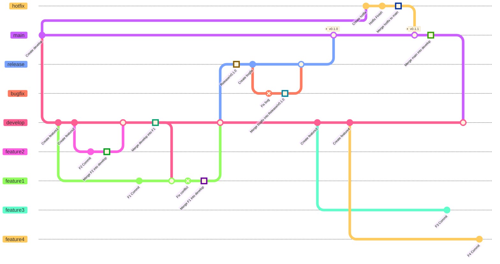

```mermaid
%%{init: {'logLevel': 'debug', 'theme': 'base', 'gitGraph': {'showBranches': true, 'showCommitLabel':true,'mainBranchOrder': 2,
            'rotateCommitLabel': true}} }%%

      gitGraph
        commit id: "Create develop"
        branch develop order:5
        branch hotfix order:1
        checkout develop
        commit id:"Create feature1"
        branch feature1 order:7
        checkout develop
        commit id:"Create feature2"
        branch feature2 order:6
        commit id:"F2 Commit"
        checkout feature2
        commit id:"Merge F2 into develop" type:HIGHLIGHT
        checkout develop
        merge feature2
        checkout feature1
        commit id:"F1 Commit"
        checkout develop
        commit id:"Merge develop into F1" type:HIGHLIGHT
        checkout feature1
        merge develop
        commit id:"Fix conflict" type:REVERSE
        commit id:"Merge F1 into develop" type:HIGHLIGHT
        checkout develop
        merge feature1
        branch release order:2
        checkout release
        commit id: "Release/v0.1.0" type:HIGHLIGHT
        commit id:"Create bugfix"
        branch bugfix order:4
        checkout bugfix
        commit id:"Fix bug" type:REVERSE
        commit id:"Merge bugfix into Release/v0.1.0" type:HIGHLIGHT
        checkout release
        merge bugfix
        checkout develop
        commit id:"Create feature3"
        branch feature3 order:8
        checkout main
        merge release tag:"v0.1.0"
        checkout develop
        commit id:"Create feature4"
        branch feature4 order:9
        checkout hotfix
        commit id:"Create hotfix"
        checkout hotfix
        commit id:"Hotfix Finish"
        checkout hotfix
        commit id:"Merge hotfix to main" type:HIGHLIGHT
        checkout main
        merge hotfix tag:"v0.1.1"
        commit id:"Merge main into develop" type:HIGHLIGHT
        checkout develop
        checkout feature3
        commit id:"F3 Commit"
        checkout develop
        merge main
        checkout feature4
        commit id:"F4 Commit"
```
